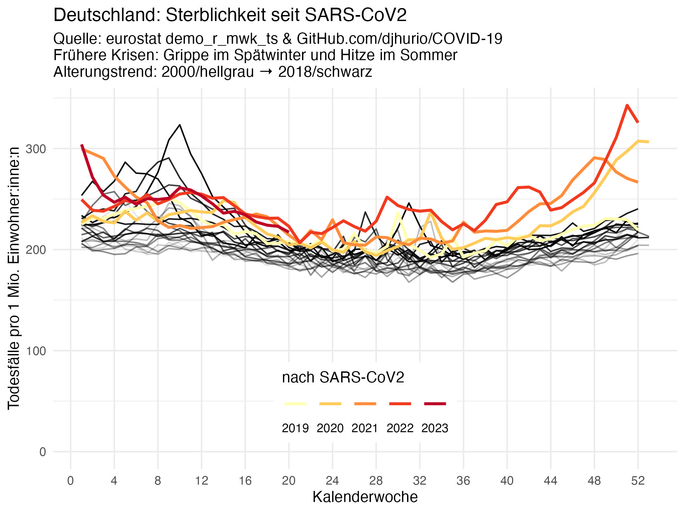

# Wöchentliche Sterblichkeit

[Original-ReadMe von djhurio](https://github.com/djhurio/COVID-19#readme).

Hier: Andere Darstellung fokussiert auf Deutschland,
mit separat zusammengefasster Sterblichkeit der prä-pandemischen Jahre.

[DeStatis](https://www.destatis.de/DE/Themen/Querschnitt/Corona/Gesellschaft/bevoelkerung-sterbefaelle.html)
dagegen vergleicht 2022 mit 2018-2021, anstatt mit mehreren Jahren *vor* CoVID19.
Für eine Erklärung dieses schmalen und vermischten Zeitraumes wäre ich dankbar.
